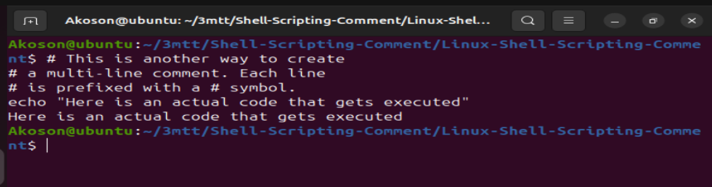

# Linux-Shell-Scripting-Comment

## In shell scripting, comments are added using the # symbol. Anything following # on a line is ignored by the shell and not executed.

## Purpose of Comments:

### To explain what the script or a section of code does

### To improve readability for yourself or others

### To temporarily disable code (for testing/debugging)

## Single Line Comments

### Single-line comments in shell scripts begin with the # symbol. Anything written after # on that line is ignored by the shell and is not executed. They are used to describe the purpose of the code, improve readability, and assist with debugging.

## Using Multiple Sinnle Comment

### Single line comments in bash start with # symbol. Anything following this symbol on the same line is treated as a comment and is not executed

### This approach is straightforward and is commonly used for adding brief descriptions or notes spanning multiple lines.

## Best Practice For Commenting

### Be Clear and Concise: Write comments that clearly explain why something is done, not just what is done.

### Avoid Obvious Comments: Don’t comment things that are self-explanatory.

## Use Full Sentences or Clear Phrases: This improves readability.

## Keep Comments Up-to-Date: Update or remove outdated comments when you change the code to prevent confusion.

## Use Consistent Style: Stick to a uniform style for all comments across the script (e.g., all in lowercase, or first-letter capitalized).