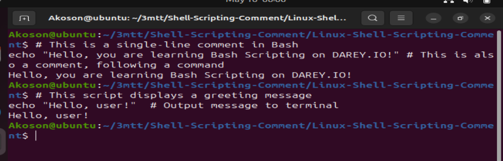

# Linux-Shell-Scripting-Comment

## In shell scripting, comments are added using the # symbol. Anything following # on a line is ignored by the shell and not executed.

## Purpose of Comments:

### To explain what the script or a section of code does

### To improve readability for yourself or others

### To temporarily disable code (for testing/debugging)

## Single Line Comments

### Single-line comments in shell scripts begin with the # symbol. Anything written after # on that line is ignored by the shell and is not executed. They are used to describe the purpose of the code, improve readability, and assist with debugging.

## Using Multiple Sinnle Comment

### Single line comments in bash start with # symbol. Anything following this symbol on the same line is treated as a comment and is not executed

### This approach is straightforward and is commonly used for adding brief descriptions or notes spanning multiple lines.

## Best Practice For Commenting

### Be Clear and Concise: Write comments that clearly explain why something is done, not just what is done.

### Avoid Obvious Comments: Don’t comment things that are self-explanatory.

## Use Full Sentences or Clear Phrases: This improves readability.

## Keep Comments Up-to-Date: Update or remove outdated comments when you change the code to prevent confusion.

## Use Consistent Style: Stick to a uniform style for all comments across the script (e.g., all in lowercase, or first-letter capitalized).

# This Bash script that demostrates how to effectively use commends in Bash scripting. The script also contain single line and multiple line comments, an inline comment for code clarity and functionalityfor printing a welcome message, creating a directory, listing files, and displaying a goodbye message.

## Screenshot

### chmod +x commented_script.sh: Use to make the code executable

### ./commented_script.sh: Use to run the script

### #!/bin/bash: This is the shebang. It tells the system to use the Bash shell to interpret the script.

### Welcome Message: 

### echo "Welcome to the Commented Script Demo!"  # Greeting

- echo prints a message to the terminal.

- The inline comment (# Greeting) explains the purpose of that line.

## Set Directory Name: 

### directory_name="demo_folder"

- This declares and initializes a variable named directory_name.

## Check and Create Directory

### if [ ! -d "$directory_name" ]; then
  ### mkdir "$directory_name"
  ### echo "Directory '$directory_name' created successfully."
### else
  ### echo "Directory '$directory_name' already exists."
### fi

- Checks if the directory exists using -d

- If it doesn't exist, it creates it using mkdir

- Then it gives a message whether it created the directory or if it already existed

## Creating Test Files

### touch "$directory_name"/file1.txt "$directory_name"/file2.txt

- Creates two empty files inside the directory for demonstration

- touch is used to create empty files

## Listing the Files

### echo "Listing files in $directory_name:"ls "$directory_name"

- Prints a heading

- Uses ls to list all files in the created folder

## Multi-line Comment

### : 'This is a multi-line comment in Bash.It uses the colon ":" with a single-quote block.It tells the shell to evaluate a no-op (:) and ignore the quoted content.'

- This is a Bash trick using : (a no-op command) and '...' to simulate a multi-line comment

## Goodbye Message

### echo "Goodbye! Script execution complete."

## Summary

## This script:

### Demonstrates single-line, inline, and multi-line comments

### Performs actual tasks: printing messages, creating a directory, creating files, and listing them

### Is structured, clean, and fits your project’s requirements